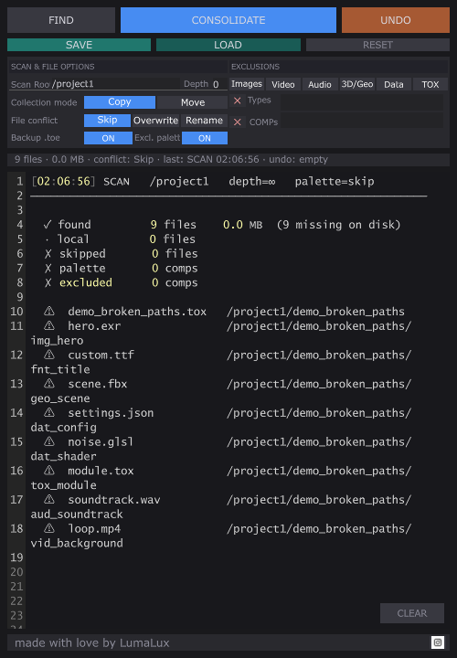

# CollectTDProject

   

> Last updated: 2026-05-05 · Released: v1.3.0 (broken-path detection, replayable relocation log, preset auto-increment + smart defaults, redesigned panel UI)

A TouchDesigner utility component that scans your project for external file dependencies, copies or moves them into a local folder structure, and rewrites operator parameters to relative paths — making your project fully portable.

---

## Screenshots



---

## The Problem

TD projects reference files by absolute path (`C:/Users/studio/assets/image.png`). Move the project to another machine or share it, and those references break. Manually hunting and relinking files is tedious and error-prone.

CollectTDProject automates the whole process.

---

## Features

- Recursive scan of the entire project network, or a defined subtree
- Detects file references across all operator types by evaluating string parameters
- **Broken-path detection** — references that point to missing or unreachable files are reported (with a ⚠ marker) instead of silently dropped, so nothing slips through
- Smart skip rule — already-local references (relative path resolving inside `project.folder` and the file actually exists) are filtered out automatically; everything else (absolute, external, broken) is recorded
- Organizes collected files into standard subfolders: `Image/`, `Movie/`, `Audio/`, `Geo/`, `Data/`, `Font/`, `Component/`
- **Copy or Move** — non-destructive copy mode by default
- **Conflict resolution** — Skip, Overwrite, or Auto-rename when a file already exists at the destination
- **Rewrites OP parameters** to relative paths after transfer (optional, on by default)
- **File size calculator** — shows total dependency size before you commit to anything
- **Undo** — reverses the last consolidation, restoring original parameter values (and returning moved files in Move mode)
- **Replayable relocation log** — every CONSOLIDATE writes a self-contained `<project>.relocation_<YYYYMMDD_HHMMSS>.py` next to the `.toe`. Run it with `python <file>.py` from anywhere to roll back the transfer (Move entries moved back, Copy/Rename entries deleted, Overwrite entries flagged unrecoverable). Survives TD restarts and works even if the project is deleted — useful when other projects or apps reference the same source files
- **Exclusion presets** — one-click toggles for Images, Video, Audio, 3D/Geo, Data, and TOX file groups
- **Palette/system exclusion** — skips components sourced from the TD palette and internal system paths
- Custom **scan scope**: set a root COMP and max recursion depth
- **Exclusion lists**: skip specific COMPs or file extensions
- Live **status bar** showing current conflict mode, file count, and last action
- **Hover tooltips** on every UI control — descriptions appear in the status bar when you hover over any button, toggle, segmented control, preset, or section header
- **Reset buttons** — global `RESET` reverts all settings to defaults; per-field `×` icons next to *Types* and *COMPs* reset just that field
- **Preset Save / Load** — write current settings to a JSON file, reload them on demand
  - **Smart defaults** — when `Presetpath` is blank, falls back to `~/Documents/Derivative/CollectTDProject` (auto-created); when `Presetname` is blank, falls back to `preset_<project_stem>` so each project keeps its own preset by default
  - **Auto-increment** — saving over an existing preset writes `preset_name_1.json`, `_2`, etc. so previous presets are never overwritten
- **Safety .toe backup** — optional toggle: when ON, CONSOLIDATE first saves a one-time `<project>.original.toe` next to the running `.toe`, preserving the truly original state across multiple consolidations
- Scrollable real-time **log viewer** with ample space for long path lists
- Self-contained: single `.tox`, no external Python packages or dependencies

---

## Requirements

- TouchDesigner 2025.32460 or later
- Python 3.11+ (bundled with TD 2025)
- Windows or macOS

---

## Installation

1. Download `CollectTDProject.tox` from the [Releases](../../releases/latest) page.
2. In TouchDesigner, drag the `.tox` into any network.
3. The component is ready immediately — no additional setup.

**Recommended placement:** Drop it at `/project1` so it can reach the full network.

---

## Usage

### Quick Start

1. Open the component viewer (`A` on the node, or click the viewer icon)
2. Click **FIND** — scans the project and lists all found file references and total size in the log
3. Review the log output, adjust exclusions if needed, re-scan
4. Click **CONSOLIDATE** — transfers files and rewrites parameters

### Panel UI

```
┌──────────┬───────────────┬──────────┐
│   FIND   │  CONSOLIDATE  │   UNDO   │   ← main actions
├──────────┼───────────────┼──────────┤
│   SAVE   │     LOAD      │  RESET   │   ← preset & reset (smaller row)
├──────────┴───────┬───────┴──────────┤
│ Scan Root        │     Depth   0    │
├──────────────────┴──────────────────┤
│ Collection mode  [ Copy ]  [ Move ] │
│ File conflict  [Skip][Overwrite][Re]│
│ Safety   Backup .toe before CONS [ON│
├─────────────────────────────────────┤
│ EXCLUSIONS                          │
│ [Images][Video][Audio][3D/Geo][Data]│
│ ×  Types   tox                      │
│ ×  COMPs                Excl. palette
├─────────────────────────────────────┤
│ 8 files · 36.4 MB · conflict: Skip  │
├─────────────────────────────────────┤
│  [SCAN 14:23] /project1  depth=∞    │
│  ✓ found      8 files   36.4 MB     │
│   + clip.mp4         /project1/...  │
│   + logo.png         /project1/...  │
│  ⚠ broken.exr        /project1/...  │  ← broken paths flagged
│                              [CLEAR]│
└─────────────────────────────────────┘
```

The top row holds the three main actions; the second row holds preset save/load and the global reset. The transfer-config rows (`Collection mode`, `File conflict`, `Safety`) share a uniform left-column label width so the right-side controls line up. The `×` icons next to *Types* and *COMPs* clear that single field.

#### Exclusion Presets

Click any preset to instantly add or remove that file group from the exclusion list:

| Preset | Extensions |
|--------|-----------|
| Images | jpg jpeg png gif bmp tif tiff exr hdr tga psd dds svg |
| Video | mp4 mov avi mkv wmv flv webm m4v mpg mpeg mxf |
| Audio | mp3 wav aiff aif ogg flac aac m4a wma |
| 3D/Geo | fbx obj abc usd usda usdc glb gltf ply stl dae 3ds |
| Data | json xml csv txt yaml toml py glsl frag vert |
| TOX | tox |

Presets are additive — toggling one preset does not affect extensions added manually or by other presets.

---

## Parameters

### Consolidate Page

| Parameter | Type | Default | Description |
|-----------|------|---------|-------------|
| Scan Root | String | *(blank)* | COMP path to start scan from. Blank = project root. |
| Max Depth | Integer | 0 | Max recursion depth. `0` = unlimited. |
| Find Files | Pulse | — | Run the file scanner. Reports file count and total size. |
| Consolidate Files | Pulse | — | Run consolidation. |
| Undo | Pulse | — | Undo the last consolidation. |
| Move Files | Toggle | Off | Move files instead of copying. |
| Modify Params | Toggle | On | Rewrite originating OP parameters to relative paths after transfer. |
| Conflict Strategy | Menu | Skip | What to do when a file already exists at the destination. Options: Skip, Overwrite, Rename. |
| Backup Before Consolidate | Toggle | Off | When ON, CONSOLIDATE saves a one-time `<project>.original.toe` next to the running `.toe` before any change. |
| Clear Log | Pulse | — | Clear the log viewer. |

### Exclusions Page

| Parameter | Type | Default | Description |
|-----------|------|---------|-------------|
| Ignore Palette COMPs | Toggle | On | Skip components sourced from the TD palette or internal library. |
| Exclude COMPs | String | *(blank)* | Comma-separated COMP paths to exclude (e.g., `/project1/bg_assets, /project1/refs`). |
| Exclude File Types | String | *(blank)* | Comma-separated extensions to skip (e.g., `tox, py, glsl`). |

### Presets Page

| Parameter | Type | Default | Description |
|-----------|------|---------|-------------|
| Preset Folder | Folder | *(blank — falls back to `~/Documents/Derivative/CollectTDProject`)* | Directory where preset JSON files live. Created automatically if the default is used and does not yet exist. |
| Preset Name | String | *(blank — falls back to `preset_<project_stem>`)* | Name of the preset to save/load (no `.json` extension needed). The default tracks the running project so each `.toe` keeps its own preset by default. |

The panel's `SAVE` and `LOAD` buttons read these two pars and write/read `<Preset Folder>/<Preset Name>.json`. The JSON contains all operational pars except `Scan Root`, `Preset Folder`, and `Preset Name`. Unknown params in a loaded JSON are skipped with a log warning (forward compatible).

**Auto-increment:** if `<Preset Name>.json` already exists at the target folder, SAVE writes `<Preset Name>_1.json`, then `_2`, etc., so previous presets are never overwritten. The log line records the new filename and notes the collision.

---

## Internal DATs

These DATs are accessible inside the component if you need to read results programmatically:

| DAT | Contents |
|-----|----------|
| `Files_Table` | All found file references: directory, filename, extension, OP path, file size, parameter name, **`Exists`** column (`'1'` if the source file is on disk, `'0'` if broken/missing) |
| `Log` | Full log output from last run |
| `Status_Data` | Summary row: file count, total MB, last action, timestamp, undo state |
| `Undo_Log` | Reversible actions for the in-component single-step UNDO |

## Replayable Relocation Log

Every successful CONSOLIDATE writes a self-contained Python file alongside your `.toe`:

```
<project>.relocation_<YYYYMMDD_HHMMSS>.py
```

The file contains a `restore()` function and an `ENTRIES` list with `(src, dst, mode, op_path, par_name)` for every transferred file. Run it from any terminal to roll back the transfer:

```bash
python <project>.relocation_20260505_143012.py
```

- **Move** entries are moved back from `dst` to `src`.
- **Copy / Rename** entries delete the destination (the original source is untouched).
- **Overwrite** entries are flagged unrecoverable (the original was replaced in-place; only the on-disk `.toe` backup can recover them — see *Safety .toe backup*).

This is intentionally external to TouchDesigner — the file works even after the project is moved, deleted, or TD is uninstalled. Especially useful when other projects or applications reference the same source files and need to find them at their original locations again.

---

## Output Folder Structure

After consolidation, files are placed next to your `.toe` file:

```
MyProject/
├── MyProject.toe
├── Image/
├── Movie/
├── Audio/
├── Geo/
├── Data/
├── Font/
└── Component/
```

---

## Undo

Undo reverses **the last consolidation only**:

- **Copy mode**: Restores original parameter values. Files at destination remain (they were copies).
- **Move mode**: Restores original parameter values and moves files back to their original locations.

Undo state is cleared when a new **FIND** scan is run.

---

## Known Limitations

- **Sequence file patterns** (e.g., `frame####.exr`) are not yet detected — only single file path references are picked up.
- File references built dynamically via Python expressions that don't resolve to a plain string at scan time will be missed.
- **Multi-step undo is not supported.** Undo covers the immediately preceding consolidation only.
- Parameters referencing files via `tdu.expandPath()` or similar TD path helpers may not evaluate correctly during scan.

---

## Contributing

Bug reports and pull requests are welcome.

Before opening a PR:

1. Test against a real project with a mix of file types (image, movie, audio, geometry). The fixture at `tests/demo_broken_paths.tox` is a starting point.
2. Verify that Undo correctly restores all parameters in both Copy and Move mode.
3. Confirm palette COMPs (Stoner, etc.) are excluded when the toggle is enabled.
4. Do not add `print()` calls for user feedback — use the `Write_log()` extension method on the component.
5. Preserve all `try/except` blocks around parameter evaluation. TD parameters frequently contain unevaluable expressions.
6. If you change the panel callbacks DAT (`ui/panel_callbacks`), confirm `par.panels.mode == ParMode.EXPRESSION` after your edits — flipping it to CONSTANT silently kills all UI dispatch.

See [CONTRIBUTING.md](CONTRIBUTING.md) for development setup, full architecture, and the panel dispatch / tooltip system reference.

---

## Acknowledgments

Built on top of [TD-File-Collector](https://github.com/mourendxu/TD-File-Collector) by [mourendxu](https://github.com/mourendxu), licensed under GPL-3.0. The core file-scanning and parameter-rewriting approach originates from that project.

---

## License

GPL-3.0 — see [LICENSE](LICENSE).
